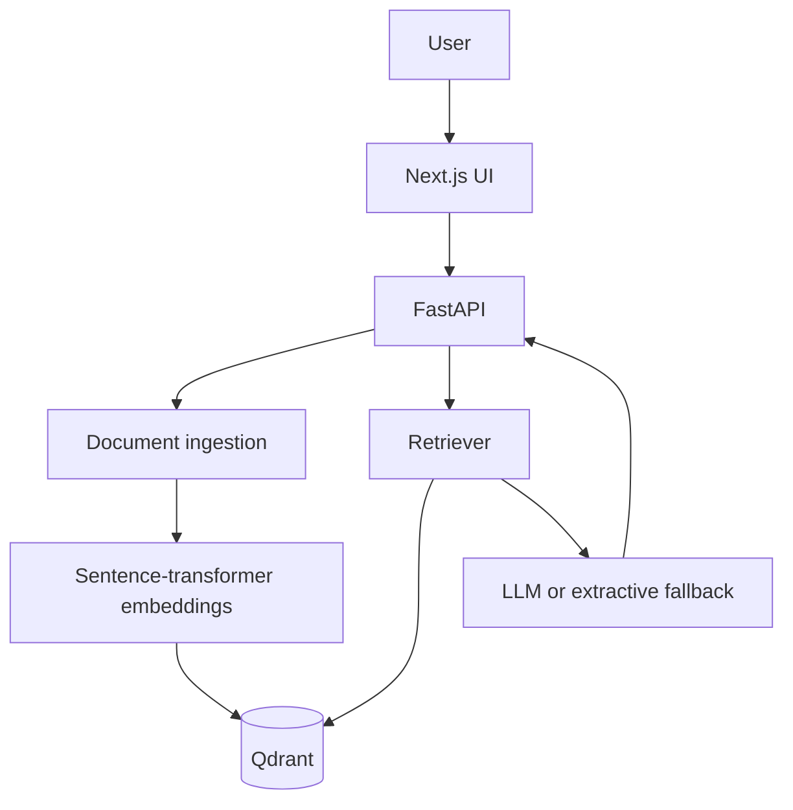

# DocIntel AI

An original, full-stack document intelligence project for uploading documents and asking grounded questions with source citations. The system combines FastAPI, Qdrant, sentence-transformer embeddings, and a Next.js interface.

> This repository is an independent implementation inspired by the general idea of modern document-intelligence platforms. It does not copy the source code of the reference repository.

## Features

- Upload PDF, DOCX, Markdown, and text documents
- Chunk and embed content with `all-MiniLM-L6-v2`
- Store vectors and metadata in Qdrant
- Retrieve relevant passages with document and page citations
- Generate grounded answers using Groq, Gemini, or Mistral
- Fall back to an extractive answer when no LLM key is configured
- Streamlined Next.js chat and document-upload interface
- Docker Compose setup for frontend, backend, and Qdrant
- Backend unit tests and GitHub Actions CI

## Architecture



## Project Structure

```text
DocIntel_AI/
├── backend/
│   ├── app/
│   │   ├── main.py
│   │   ├── config.py
│   │   ├── ingestion.py
│   │   ├── retrieval.py
│   │   └── schemas.py
│   ├── tests/
│   ├── Dockerfile
│   └── requirements.txt
├── frontend/
│   ├── app/
│   ├── Dockerfile
│   └── package.json
├── .github/workflows/ci.yml
└── docker-compose.yml
```

## Quick Start

1. Clone the repository and create the backend environment file:

   ```bash
   cp backend/.env.example backend/.env
   ```

2. Optionally add one provider key to `backend/.env`.

3. Start the complete stack:

   ```bash
   docker compose up --build
   ```

4. Open:

   - Application: http://localhost:3000
   - API documentation: http://localhost:8000/docs
   - Qdrant dashboard: http://localhost:6333/dashboard

## API

| Method | Endpoint | Purpose |
|---|---|---|
| `GET` | `/health` | Service and vector-store health |
| `POST` | `/api/documents` | Upload and index a document |
| `GET` | `/api/documents` | List indexed documents |
| `DELETE` | `/api/documents/{document_id}` | Delete document vectors |
| `POST` | `/api/query` | Retrieve evidence and answer a question |

## Environment Variables

| Variable | Default | Description |
|---|---|---|
| `QDRANT_URL` | `http://qdrant:6333` | Qdrant endpoint |
| `COLLECTION_NAME` | `docintel_chunks` | Vector collection |
| `LLM_PROVIDER` | `extractive` | `extractive`, `groq`, `gemini`, or `mistral` |
| `GROQ_API_KEY` | empty | Groq key |
| `GOOGLE_API_KEY` | empty | Gemini key |
| `MISTRAL_API_KEY` | empty | Mistral key |
| `NEXT_PUBLIC_API_URL` | `http://localhost:8000` | Browser-facing API URL |

## Security Notes

- Never commit `.env` files or API keys.
- Add authentication, file scanning, rate limits, and tenant isolation before production use.
- Validate cloud retention and data-residency requirements before indexing sensitive documents.

## Roadmap

- Conversational memory and saved sessions
- Hybrid lexical/vector search and reranking
- Retrieval evaluation with a golden question set
- OCR for scanned PDFs
- Authentication and per-user collections
- Streaming answers and agentic multi-hop retrieval

## License

MIT — see [LICENSE](LICENSE).
